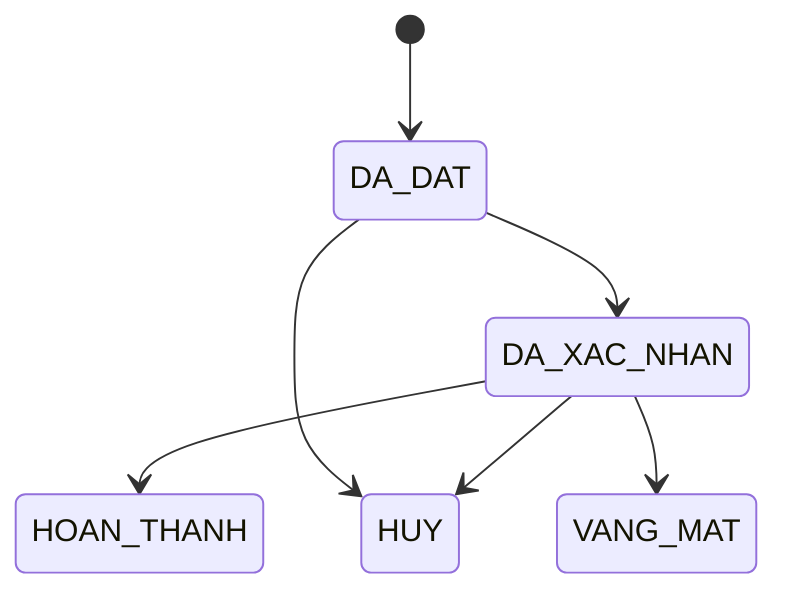

# T03 – Ghi chú khảo sát mảng B: Bệnh nhân & Lịch hẹn

| | |
|---|---|
| Mã việc | T03 (GĐ0, tuần 1) |
| Người làm / review | Lê Ngọc Khôi / Nguyễn Đăng Khoa |
| Ngày | 08/10/2026 |
| Dùng cho | T08 (BR-B), T12 (ERD mảng B) |

Mục tiêu: rút ra **thực thể, thuộc tính, trạng thái và quy tắc** đủ cho một CSDL đồ án môn học. Không mô tả đầy đủ nghiệp vụ y tế thật.

## 1. Phạm vi mảng B

| Trong phạm vi | Ngoài phạm vi (đơn giản hóa) |
|---|---|
| Hồ sơ bệnh nhân | Tài khoản đăng nhập, đặt hộ người thân |
| Đặt lịch: khám trực tiếp / tư vấn từ xa | Cuộc gọi video thật (chỉ lưu link phiên) |
| Chuyển chuyên khoa (quy trình nội bộ phòng khám) | Chuyển tuyến BHYT giữa các cơ sở |
| Hóa đơn: 1 lịch hẹn – 1 hóa đơn | Cổng thanh toán thật, BHYT chi trả, hoàn tiền, hóa đơn điện tử theo luật thuế |

## 2. Quy trình khảo sát được

Tham khảo các ứng dụng đặt khám Medpro, YouMed và BookingCare. Cả ba có luồng chung như sau:

1. **Đặt lịch**: chọn hình thức (trực tiếp / video) → chuyên khoa → bác sĩ → ngày, giờ còn trống trong lịch làm việc của bác sĩ → nhập thông tin bệnh nhân, lý do khám. Bệnh nhân tự đặt hoặc lễ tân đặt hộ.
2. **Xác nhận**: lễ tân xác nhận lịch. Với tư vấn từ xa, các app bắt thanh toán trước rồi mới xác nhận.
3. **Khám trực tiếp**: bệnh nhân đến đúng giờ, bác sĩ khám. Phần khám, chẩn đoán, kê đơn thuộc **mảng C** (LAN_KHAM).
4. **Tư vấn từ xa**: giống khám trực tiếp, nhưng bệnh nhân vào cuộc gọi qua link vào giờ hẹn.
5. **Chuyển chuyên khoa**: bác sĩ đa khoa thấy cần thì lập giấy chuyển, bệnh nhân dùng giấy đó để đặt lịch chuyên khoa.
6. **Thanh toán**: thu phí theo lịch hẹn, gồm tiền mặt, chuyển khoản và ví điện tử.

Lưu ý cho báo cáo mục 1: từ 01/7/2025, Luật BHYT sửa đổi (51/2024/QH15) đã thay "chuyển tuyến" bằng "chuyển người bệnh giữa các cơ sở". Giấy chuyển chuyên khoa của nhóm chỉ là **quy trình nội bộ trong một phòng khám**, không liên quan BHYT.

## 3. Thực thể đề xuất (đầu vào T12)

| Thực thể | Thuộc tính chính | Liên kết |
|---|---|---|
| BENH_NHAN | ma_bn, ho_ten, ngay_sinh, gioi_tinh, sdt (UNIQUE), email | 1:N LICH_HEN |
| LICH_HEN (lớp cha) | ma_lh, thoi_gian_bd, thoi_gian_kt, ly_do_kham, trang_thai, ngay_tao | N:1 BENH_NHAN, BAC_SI (A); 1:1 LAN_KHAM (C) |
| KHAM_TRUC_TIEP (lớp con) | phong_kham | ISA LICH_HEN |
| TU_VAN_TU_XA (lớp con) | nen_tang, link_phien, thoi_luong_phut | ISA LICH_HEN |
| GIAY_CHUYEN_KHOA | ma_giay, ngay_lap, ly_do, ngay_het_han | N:1 BENH_NHAN, BAC_SI_DA_KHOA (A), CHUYEN_KHOA (A); 0..1 LICH_HEN dùng giấy |
| HOA_DON | ma_hd, so_tien, phuong_thuc, trang_thai, thoi_diem_thanh_toan | 1:1 LICH_HEN |

- Phân lớp LICH_HEN → {KHAM_TRUC_TIEP, TU_VAN_TU_XA}: **disjoint, total** (mỗi lịch hẹn có đúng một hình thức). Đây là điểm EER của mảng B.
- Chuyên khoa của lịch hẹn lấy qua bác sĩ, nên không cần cột riêng.
- Cần thống nhất với Hữu Khoa: tên khóa của BAC_SI, CA_LAM_VIEC, CHUYEN_KHOA. Cần thống nhất với Đăng Khoa: LAN_KHAM có `ma_lh` UNIQUE NOT NULL.

## 4. Trạng thái lịch hẹn

Giữ 5 trạng thái như v0:

Lịch hẹn ở trạng thái HUY hoặc VANG_MAT **không chiếm giờ** của bác sĩ. Ràng buộc chống trùng giờ bỏ qua hai trạng thái này.

## 5. Quy tắc nghiệp vụ đề xuất (đầu vào T08)

| Mã | Phát biểu | Cơ chế |
|---|---|---|
| BR-B01 | Lịch hẹn nằm trọn trong một ca làm việc của bác sĩ được hẹn | Trigger `trg_lich_hen_hop_le` |
| BR-B02 | Một bác sĩ không có hai lịch hẹn trùng giờ (trừ HUY, VANG_MAT) | `EXCLUDE USING gist` trên (ma_bac_si, khoảng thời gian) |
| BR-B03 | Khám bác sĩ chuyên khoa cần giấy chuyển còn hạn, đúng chuyên khoa, chưa dùng | Trigger + UNIQUE trên cột ma_giay của LICH_HEN |
| BR-B04 | Tư vấn từ xa bắt buộc có link phiên và thời lượng > 0 | NOT NULL + CHECK |
| BR-B05 | Trạng thái chỉ chuyển theo sơ đồ mục 4 | Trigger `trg_trang_thai_lich_hen` |
| BR-B06 | thoi_gian_kt > thoi_gian_bd | CHECK |
| BR-B07 | Chỉ lập hóa đơn cho lịch hẹn HOAN_THANH; so_tien ≥ 0 | CHECK + trigger |

## 6. Cần chốt trong buổi họp

1. Lưu khung giờ dạng **khoảng thời gian bất kỳ** (đề xuất: gọn, dùng được EXCLUDE của PostgreSQL) hay tạo sẵn bảng khung giờ?
2. BR-B03 có miễn cho **tái khám** như v0 không? Nếu miễn thì định nghĩa: đã có lịch HOAN_THANH với cùng bác sĩ trong 30 ngày.

## Nguồn tham khảo

- Medpro – hình thức đặt khám: https://medpro.vn/cho-ray/hinh-thuc-dat-kham ; tư vấn online: https://medpro.vn/tin-tuc/tu-van-suc-khoe-online
- YouMed (App Store): https://apps.apple.com/app/id1466077723
- BookingCare (App Store): https://apps.apple.com/vn/app/id1347700144
- Điểm mới về chuyển tuyến BHYT từ 01/7/2025: https://luatvietnam.vn/bao-hiem/3-diem-moi-ve-chuyen-tuyen-bhyt-tu-ngay-01-7-2025-563-100345-article.html
